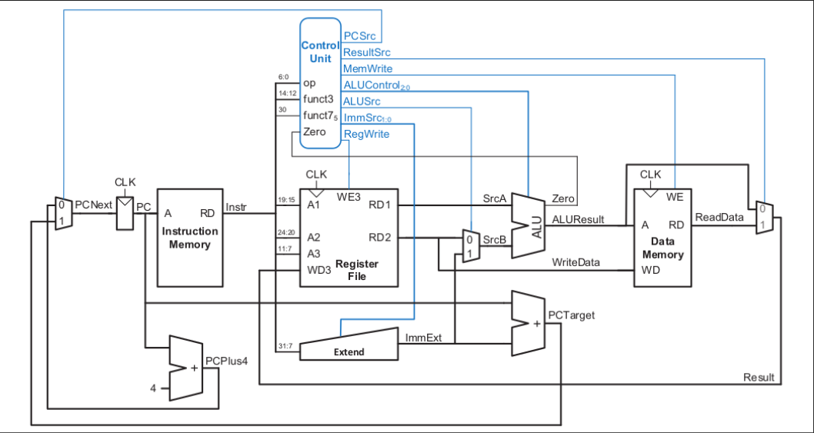

# RISC-V Single Cycle Core

This repository contains the Verilog implementation of a **32-bit RISC-V single-cycle processor**.  
The design follows the RV32I base instruction set architecture and includes separate modules for the ALU, instruction memory, data memory, control unit, register file, and more.

## Features
- **Single-Cycle Execution**: Each instruction completes in one clock cycle.
- **32-bit ALU** supporting arithmetic, logical, and shift operations.
- **Instruction Memory** and **Data Memory** modules for program storage and execution.
- **Control Unit** with main and ALU decoders.
- **Register File** supporting dual-read and single-write operations.
- **Sign Extension** for immediate values.
- **Program Counter (PC)** management with PC Adder.
- **Fully modular design** for easy testing and debugging.

## File Structure
| File Name                | Description |
|--------------------------|-------------|
| `ALU.v`                  | Arithmetic Logic Unit for performing operations. |
| `Data_Memory.v`          | Data memory for load/store instructions. |
| `Instruction_Memory.v`   | Stores the program instructions. |
| `PC_Adder.v`              | Increments the program counter. |
| `PC_Module.v`            | Holds the current program counter value. |
| `Register_File.v`        | 32 registers with read/write functionality. |
| `Sign_Extend.v`          | Extends immediate values to 32 bits. |
| `alu_decoder.v`          | Decodes ALU control signals. |
| `main_decoder.v`         | Generates control signals for instruction execution. |
| `Single_Cycle_Top.v`     | Top-level module integrating all components. |
| `Single_Cycle_Top_Tb.v`  | Testbench for verifying the design. |

## Block Diagram

